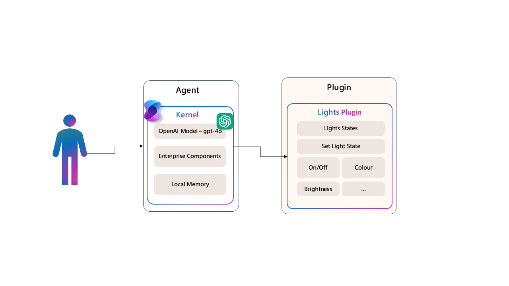

# 💡 Lab 01: Introduction to Semantic Kernel - Lights Plugin Demo



Welcome to the first lab of our Agentic AI Workshop! In this lab, you'll learn the fundamentals of Semantic Kernel and build your first AI agent with a custom plugin.

## 🎯 Learning Objectives

- Understand the core architecture of Semantic Kernel
- Create and configure a Semantic Kernel instance
- Build and register custom plugins
- Enable function calling in LLMs
- Create a conversational agent that can control lights through natural language

## 🧠 Semantic Kernel Concepts

### What is Semantic Kernel?

Semantic Kernel (SK) is an open-source SDK that integrates Large Language Models (LLMs) with conventional programming languages. It provides a structured framework that allows developers to:

1. 🔌 Create plugins that LLMs can invoke
2. 🔄 Orchestrate interactions between LLMs and traditional code
3. 🧩 Build complex AI applications with modular, reusable components

The key insight behind Semantic Kernel is that while LLMs are powerful at understanding and generating text, they need structured ways to interact with systems and data. SK bridges this gap by providing a framework for creating "plugins" that LLMs can invoke based on natural language input.

### Enterprise-Ready Architecture
Semantic Kernel is designed to be enterprise-ready, meaning it can handle complex scenarios with multiple plugins, services, and data sources. It supports:
- **Scalability**: Handle large volumes of requests and data
- **Modularity**: Create reusable components that can be shared across applications
- **Extensibility**: Easily add new functionalities through plugins

Microsoft and other Fortune 500 companies are already leveraging Semantic Kernel because it’s flexible, modular, and observable. Backed with security enhancing capabilities like telemetry support, and hooks and filters so you’ll feel confident you’re delivering responsible AI solutions at scale.

Version 1.0+ support across C#, Python, and Java means it’s reliable, committed to non breaking changes. Any existing chat-based APIs are easily expanded to support additional modalities like voice and video.

Semantic Kernel was designed to be future proof, easily connecting your code to the latest AI models evolving with the technology as it advances. When new models are released, you’ll simply swap them out without needing to rewrite your entire codebase.

#### Automating Complex Tasks with Semantic Kernel
Semantic Kernel combines prompts with existing APIs to perform actions. By describing your existing code to AI models, they’ll be called to address requests. When a request is made the model calls a function, and Semantic Kernel is the middleware translating the model's request to a function call and passes the results back to the model.

#### Modular and extensible


By adding your existing code as a plugin, you’ll maximize your investment by flexibly integrating AI services through a set of out-of-the-box connectors. Semantic Kernel uses OpenAPI specifications (like Microsoft 365 Copilot) so you can share any extensions with other pro or low-code developers in your company.


### Core Components of Semantic Kernel


Semantic Kernel has several key components:

1. **Kernel**: The central orchestrator that manages plugins, services, and execution
2. **Plugins**: Collections of functions that the LLM can invoke
3. **Functions**: Individual capabilities that perform specific tasks
4. **Chat Completions**: Services that interact with LLM providers
5. **Memory**: Services for storing and retrieving information

## 🚀 Getting Started

### Prerequisites

Before starting this lab, make sure you have:

- .NET SDK 9.0 or later installed
- An IDE like Visual Studio or VS Code
- Access to Azure OpenAI or OpenAI API
- API keys for these services

Run these commands to check your .NET version:
```bash
dotnet --version
```

In case you need to install the .NET SDK, follow the instructions on the [official .NET website](https://dotnet.microsoft.com/download).

in case you need to install VS Code, follow the instructions on the [official Visual Studio Code website](https://code.visualstudio.com/Download).

Access to Azure OpenAI or OpenAI API is required to run the Semantic Kernel agent. You can sign up for an API key on the [Azure OpenAI Service](https://azure.microsoft.com/en-us/services/cognitive-services/openai-service/) or [OpenAI](https://platform.openai.com/signup), during the workshop these keys will be provided to you.

### Project Structure

Our project consists of these main files:

- **Program.cs**: Main application that sets up and runs the Semantic Kernel agent
- **LightsPlugin.cs**: A custom plugin that simulates controlling lights
- **LightPluginDemo.csproj**: Project configuration with dependencies

## 🔧 Step 1: Setting Up the Environment

First, we need to set up our project and configure the environment:

1. Clone the repository if you haven't already.
2. Navigate to the Lab01 directory.
3. Create a `.env` file with your API keys:

```
AZURE_OPENAI_ENDPOINT=https://your-endpoint.openai.azure.com
AZURE_OPENAI_KEY=your-api-key
```

4. Run `dotnet restore` to install dependencies.

## 🏗️ Step 2: Understanding the Kernel Setup

In `Program.cs`, we initialize Semantic Kernel with the necessary services:

```csharp
// Create a kernel with Azure OpenAI chat completion
var builder = Kernel.CreateBuilder().AddAzureOpenAIChatCompletion(modelId, endpoint, apiKey);

// Add enterprise components
builder.Services.AddLogging(services => services.AddConsole().SetMinimumLevel(LogLevel.Warning));

// Build the kernel
Kernel kernel = builder.Build();
```

This code:
1. Creates a kernel builder
2. Adds Azure OpenAI chat completion service
3. Configures logging
4. Builds the final kernel instance

## 🔌 Step 3: Creating a Custom Plugin

The `LightsPlugin` is a custom native plugin that simulates controlling lights:

```csharp
public class LightsPlugin
{
   // Mock data for the lights
   private readonly List<LightModel> lights = new()
   {
      new LightModel { Id = 1, Name = "Main Stage", IsOn = false, Brightness = Brightness.Medium, Color = "#FFFFFF" },
      // More lights...
   };

   [KernelFunction("get_lights")]
   [Description("Gets a list of lights and their current state")]
   public async Task<List<LightModel>> GetLightsAsync()
   {
      return lights;
   }

   // More functions...
}
```

Key components of the plugin:
- **KernelFunction Attribute**: Marks methods that the LLM can call
- **Description Attribute**: Provides context to the LLM about what the function does
- **Return Types**: Structured data that the LLM can process

## 🧩 Step 4: Registering the Plugin

We register the plugin with the kernel, making its functions available to the LLM:

```csharp
// Add a plugin (the LightsPlugin class is defined in its own file)
kernel.Plugins.AddFromType<LightsPlugin>("Lights");
```

The string "Lights" is the namespace for the plugin, which helps the LLM understand the context for these functions.

## 💬 Step 5: Creating a Conversational Agent

We set up a conversational loop that:
1. Gets user input
2. Processes it through the kernel
3. Returns responses from the AI

```csharp
// Create a history store the conversation
var history = new ChatHistory();

// Initiate a back-and-forth chat
string? userInput;
do {
    // Get user input and process it
    // ...
} while (userInput is not null);
```

## 🔍 Step 6: Function Calling

We enable function calling to allow the LLM to invoke our plugin functions:

```csharp
// Enable planning
OpenAIPromptExecutionSettings openAIPromptExecutionSettings = new() 
{
    FunctionChoiceBehavior = FunctionChoiceBehavior.Auto()
};
```

This setting tells the LLM to automatically detect when to call functions based on user input.

## 🧪 Hands-on Exercises

### Exercise 1: Run the code and try to control lights

Start small and ask the agent how many lights are there, to list the lights and other basic operations. You can also try turning on or off a specific light by name or ID.

Now lets try something more advanced. You can ask the agent how many lights are Yellow and see how it handles the fact that it has to call the `get_lights` function to get the list of lights and figure out the RGB code for yellow as all colors are stored as RGB values.

Now lets make this even more advanced. You can ask the agent to toggle all yellow lights, this will make him have to plan the work to figure out how to do a toggle operation.

Finally ask the agent to explain to you how he did that and you will see how he explains the steps he took to achieve the result.

### Exercise 2: Add a New Function

Now lets make this interesting!
Now that you understand the basics, let's extend our plugin.

Create a new function in the plugin to make a light blink on and off. So now lights will have a new state called `Blinking` and you can ask the agent to make a light blink.

Also to make a light blink and stop a light from blinking.

Try different forms of implementing these functions and try it out with the agent.

## 🔍 In-depth: How Function Calling Works

When a user types something like "turn on the Main Stage light", here's what happens:

1. The input is sent to the LLM with function definitions
2. The LLM determines that this requires the `change_state` function
3. The LLM extracts parameters (id=1, isOn=true)
4. The kernel invokes the function with these parameters
5. The function updates the light state and returns the result
6. The LLM formulates a user-friendly response

This process creates a seamless experience where the user can interact naturally with the system.

## 🚀 Challenge: Create a Scene Plugin

As a challenge, create a "Scene" plugin that can control multiple lights at once with presets like "Movie Night" or "Party Mode".

## 📚 Additional Resources

- [Semantic Kernel Documentation](https://learn.microsoft.com/en-us/semantic-kernel/overview/)
- [Creating Native Functions](https://learn.microsoft.com/en-us/semantic-kernel/agents/plugins/native-functions?tabs=Csharp)
- [Function Calling in OpenAI Models](https://platform.openai.com/docs/guides/function-calling)

## ✅ Lab Completion Checklist

- [ ] Set up the Semantic Kernel environment
- [ ] Understand the core components of Semantic Kernel
- [ ] Create and register a custom plugin
- [ ] Enable function calling in your agent
- [ ] Complete the hands-on exercises
- [ ] Create a Scene plugin (challenge)

## 🏁 Next Steps

After completing this lab, you're ready to move on to [Lab 02: Working with Built-in Plugins](../Lab02_BuiltIn/lab02.md), where you'll learn to leverage existing plugins and understand plugin architecture better.
