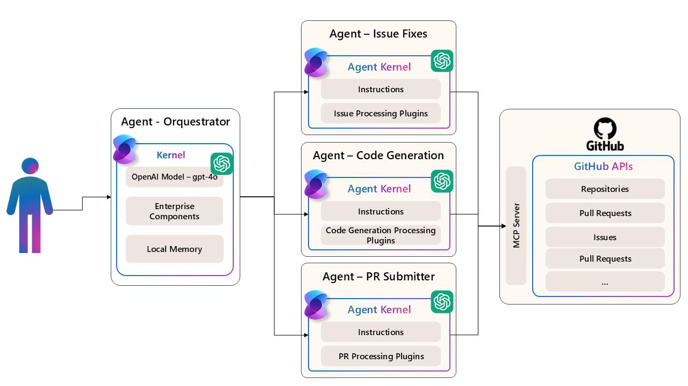

# 📡 Lab 03: Model Context Protocol (MCP) - Advanced Agent Integration



Welcome to the third lab of our Agentic AI Workshop! In this advanced lab, we'll explore the Model Context Protocol (MCP) - a powerful communication mechanism that enables AI agents to interact with external systems in a standardized way.

## 🎯 Learning Objectives

- Understand the Model Context Protocol (MCP) architecture and benefits
- Create MCP clients that connect to external tool servers
- Build GitHub integration agents using MCP
- Implement a complete MCP client-server architecture
- Create multi-agent systems that collaborate on complex development tasks
- Learn how to use request/response filters for enhanced monitoring and control

## 🧠 Model Context Protocol (MCP) Concepts

### What is Model Context Protocol (MCP)?

The Model Context Protocol (MCP) is an open protocol that standardizes communication between language models and external tools/services. It defines:

1. 🔄 **Standardized Communication**: Common interfaces for model-tool interactions
2. 🛠️ **Tool Discovery and Invocation**: How models can discover and use external tools
3. 📄 **Structured Data Exchange**: Standard formats for passing data between models and tools
4. 🔌 **Tool Servers**: Services that expose functionality through MCP endpoints

MCP enables agents to interact with a wide range of external systems without requiring custom integration code for each one.

### MCP Architecture

The MCP architecture has several key components:

1. **MCP Client**: The component that communicates with MCP servers, typically embedded in your application
2. **MCP Server**: A service that exposes functionality as MCP tools
3. **Transport Layer**: Handles communication between clients and servers
4. **Tools**: Functions exposed by the server that can be discovered and called by the client
5. **Semantic Kernel Integration**: Allows tools to be registered as kernel functions

## 🚀 Getting Started

### Prerequisites

Before starting this lab, make sure you have:

- Completed Labs 01 and 02 to understand Semantic Kernel basics
- .NET SDK 9.0 or later installed
- Docker or Podman for running the GitHub MCP server
- Access to Azure OpenAI or OpenAI API
- A GitHub Personal Access Token with appropriate permissions

### Setting Up Your Environment

1. Navigate to the Lab03 directory
2. Create a `.env` file with your API keys:

```
AZURE_OPENAI_ENDPOINT=https://your-endpoint.openai.azure.com
AZURE_OPENAI_KEY=your-api-key
GITHUB_PERSONAL_ACCESS_TOKEN=your-github-token
```

3. Run `dotnet restore` to install dependencies for each project

## 🏗️ Project 1: GitHub MCP Agent

In this project, we'll build an agent that can interact with GitHub repositories through the GitHub MCP server.

### Project Overview

The `GitHubMCPAgent` project demonstrates:
- Connecting to the GitHub MCP server
- Discovering available GitHub tools
- Creating two modes of interaction:
  - Tool mode: direct invocation of MCP tools
  - Agent mode: creating a conversational agent that uses MCP tools

### Step 1: Understanding MCP Client Setup

The first step is to create an MCP client that connects to the GitHub MCP server:

```csharp
// Create an MCPClient for the GitHub server
var clientTransport = new StdioClientTransport(new StdioClientTransportOptions
{
    Name = "MCPServer",
    Command = "npx",
    Arguments = ["-y", "@modelcontextprotocol/server-github"],
    EnvironmentVariables =  new() {{ "GITHUB_PERSONAL_ACCESS_TOKEN", gitHubToken }},
});

var mcpClient = await McpClientFactory.CreateAsync(clientTransport);
```

This code:
1. Creates a transport layer that connects to the GitHub MCP server through standard I/O
2. Configures the server to use your GitHub Personal Access Token
3. Creates an MCP client that can communicate with the server

### Step 2: Discovering Available Tools

Next, we discover what tools are available on the GitHub MCP server:

```csharp
// Retrieve the list of tools available on the GitHub server
var tools = await mcpClient.ListToolsAsync().ConfigureAwait(false);
foreach (var tool in tools)
{
    Console.WriteLine($"{tool.Name}: {tool.Description}");
}
```

This code retrieves all available GitHub tools and their descriptions, such as:
- `get_issue`: Gets details of a specific GitHub issue
- `list_issues`: Lists issues in a repository
- `create_pull_request`: Creates a new pull request
- And many others

### Step 3: Registering MCP Tools as Kernel Functions

We register these tools as kernel functions, making them available to the LLM:

```csharp
// Add tools to the kernel
kernel.Plugins.AddFromFunctions("GitHub", tools.Select(aiFunction => aiFunction.AsKernelFunction()));
```

This process maps each MCP tool to a kernel function that can be called by the LLM.

### Step 4: Creating a GitHub Agent

Finally, we create a dedicated GitHub agent that can use the tools:

```csharp
// Define the agent
ChatCompletionAgent agent = new ChatCompletionAgent()
{
    Instructions = "Answer questions about GitHub repositories.",
    Name = "GitHubAgent",
    Kernel = kernel,
    Arguments = new KernelArguments(executionSettings),
};
```

This agent can:
- Answer questions about GitHub repositories
- Retrieve and summarize issues
- List commits and pull requests
- And more, all through natural language interaction

## 🧪 MCP Client-Server Project

In this project, we'll explore the MCP client-server architecture in more depth.

### Project Overview

The `MCPClientServer` project demonstrates:
- The core components of an MCP client
- Different ways to use MCP in your application
- How to work with tools, resources, and templates

### Step 1: Understanding the MCP Client Samples

The project includes several samples that demonstrate different aspects of MCP:

1. **MCP Tools Sample**: Basic tool discovery and invocation
2. **MCP Prompt Sample**: Using MCP with prompts
3. **MCP Resources Sample**: Working with resources
4. **MCP Resource Templates Sample**: Using templates
5. **MCP Sampling Sample**: Working with sampling features
6. **Chat Completion Agent Sample**: Using MCP with agents

### Step 2: Working with MCP Tools

The `MCPToolsSample` demonstrates how to use MCP tools:

```csharp
// Create an MCP client
await using IMcpClient mcpClient = await CreateMcpClientAsync();

// Retrieve and display the list provided by the MCP server
IList<McpClientTool> tools = await mcpClient.ListToolsAsync();
DisplayTools(tools);

// Create a kernel and register the MCP tools
Kernel kernel = CreateKernelWithChatCompletionService();
kernel.Plugins.AddFromFunctions("Tools", tools.Select(aiFunction => aiFunction.AsKernelFunction()));
```

This pattern allows your application to:
1. Connect to any MCP server
2. Discover available tools
3. Register them as kernel functions
4. Use them in your AI applications

### Step 3: Creating Your Own MCP Server

An MCP server can expose any functionality as tools. To create your own:

1. Define the tools you want to expose
2. Implement the MCP server interface
3. Host it as a service (console app, web service, etc.)

The MCP server provides standardized endpoints for:
- Tool discovery (`ListTools`)
- Tool invocation (`RunTool`)
- Resource management (optional)

## 🤖 Coder Team MCP Project

In this project, we'll build a multi-agent system where specialized agents collaborate to implement GitHub features.

### Project Overview

The `CoderTeamMCP` project demonstrates:
- Creating specialized agents with specific responsibilities
- Using MCP tools across multiple agents
- Orchestrating complex workflows with an orchestrator agent
- Using filters to monitor tool invocations

### Step 1: Creating Specialized Agents

We create three specialized agents, each with different responsibilities:

```csharp
// Define Agent Configurations
var issueReaderAgentTools = new HashSet<string> { "get_issue", "list_issues" };
var codeWriterAgentTools = new HashSet<string> { "get_file_contents", "create_branch", "create_or_update_file", "list_branches" };
var pullRequestAgentTools = new HashSet<string> { "create_pull_request", "create_pull_request_review" };

// Create specialized kernels for each agent
var issueReaderKernel = mainKernel.Clone();
var codeWriterKernel = mainKernel.Clone();
var pullRequestKernel = mainKernel.Clone();
```

Each agent has:
- Access only to the tools it needs
- Clear instructions for its specific role
- A focused responsibility area

### Step 2: Creating the Agent Plugin System

We create a plugin system where each specialized agent is exposed as a function:

```csharp
// Create agents as plugins
var agentPlugin = KernelPluginFactory.CreateFromFunctions("GitHubAgentPlugin",
    [
        AgentKernelFunctionFactory.CreateFromAgent(new ChatCompletionAgent()
        {
            Name = "IssueReaderAgent",
            Instructions = "You are an agent that reads and lists GitHub issues...",
            // ...
        }),
        // Other agents...
    ]);

// Add the agent plugin to the main kernel
mainKernel.Plugins.Add(agentPlugin);
```

This approach allows agents to be invoked like any other function.

### Step 3: Creating the Orchestrator Agent

We create an orchestrator agent that coordinates the specialized agents:

```csharp
ChatCompletionAgent orchestratorAgent = new()
{
    Name = "GitHubOrchestrator",
    Instructions = @"You are a GitHub workflow orchestrator that coordinates between specialized agents...",
    Kernel = mainKernel,
    Arguments = new KernelArguments(new PromptExecutionSettings() 
        { FunctionChoiceBehavior = FunctionChoiceBehavior.Auto(options: new () { RetainArgumentTypes = true } ) }),
};
```

The orchestrator:
- Understands the capabilities of each specialized agent
- Delegates tasks appropriately
- Coordinates complex workflows across multiple agents

### Step 4: Using Filters for Monitoring

We add a filter to monitor tool invocations:

```csharp
public sealed class AutoFunctionInvocationFilter() : IAutoFunctionInvocationFilter
{
    public async Task OnAutoFunctionInvocationAsync(AutoFunctionInvocationContext context, Func<AutoFunctionInvocationContext, Task> next)
    {
        Console.WriteLine($"Invoke: {context.Function.Name} - {context.Function.Description} - ({context.Function.PluginName})");

        await next(context);
    }
}
```

This filter logs each function invocation, providing visibility into what tools are being called.

## 🧪 Hands-on Exercises

### Exercise 1: Testing the GitHub MCP Agent

Run the provided code to test the GitHub MCP agent. Experiment with different queries and observe how the agent interacts with GitHub repositories.

Example: Ask the agent to list issues in a specific repository (for example the Microsoft/semantic-kernel) or summarize the latests commits of a repository.

### Exercise 2: Enhancing the GitHub Agent

Modify the GitHub agent to:
1. Add a filter to the MCP tools to only include tools for issue reading 

test the agent with a workflow that includes issue reading and listing and try to make the agent do more things that are outside of the issue reading scope, like creating a pull request or listing commits and see the agent not being able to do that.

### Exercise 3: Expanding the Coder Team

Add a new specialized agent to the Coder Team:
1. Create a `CodeReviewerAgent` with tools for reviewing code
2. Update the orchestrator to use this agent
3. Test it with a workflow that includes code review

## 🚀 Challenge: Build an End-to-End Development Workflow

Create a complete development workflow that:
1. Reads an issue from a repository
2. Creates a new branch
3. Implements code changes according to the issue
4. Creates tests for the changes
5. Creates a pull request with a detailed description
6. Provides a code review

## 📚 Additional Resources

- [Model Context Protocol Documentation](https://github.com/microsoft/modelcontextprotocol)
- [Semantic Kernel MCP Integration](https://learn.microsoft.com/en-us/semantic-kernel/reliability/model-context-protocol)
- [GitHub MCP Server Documentation](https://github.com/github/github-mcp-server)
- [Multi-Agent Collaboration Patterns](https://learn.microsoft.com/en-us/semantic-kernel/agents/multi-agent)

## ✅ Lab Completion Checklist

- [ ] Understand the Model Context Protocol architecture
- [ ] Create a GitHub agent using MCP
- [ ] Explore the MCP client-server architecture
- [ ] Build a multi-agent system for GitHub workflows
- [ ] Complete the hands-on exercises
- [ ] Build the end-to-end development workflow challenge

## 🏁 Next Steps

After completing this lab, you're ready to move on to [Lab 04: Multi-Agent Orchestration](../Lab04_Multi-Agent_Orchestration/lab04.md), where you'll learn more advanced techniques for orchestrating multiple agents in complex scenarios.