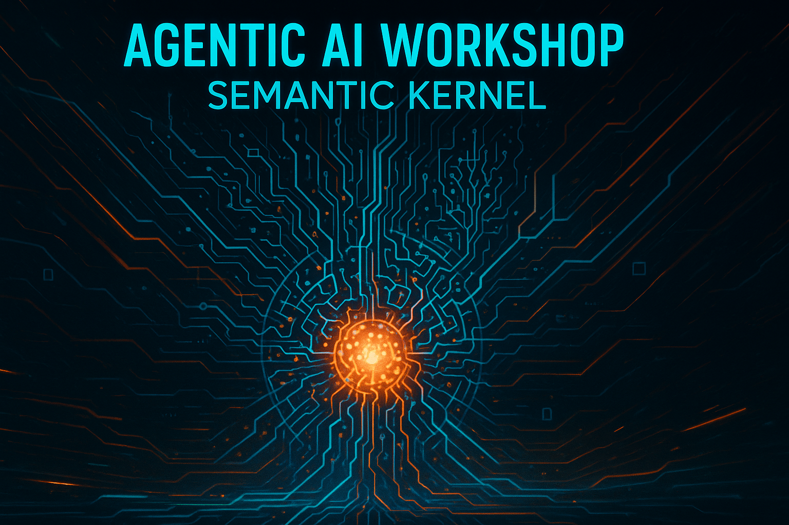

# 🚀 Agentic AI Workshop - Semantic Kernel

> Building the Agentic Future

Welcome to our intensive, hands-on workshop on building agentic AI applications using Microsoft's Semantic Kernel framework! This workshop will take you from foundational concepts to advanced multi-agent orchestration through a series of progressive labs.

## 📚 Overview

This workshop explores the cutting-edge world of Agentic AI using Microsoft's Semantic Kernel framework. Through a series of four progressive labs, you'll learn how to build, customize, and orchestrate AI agents to perform complex tasks.

### 🧠 What is Semantic Kernel?

Semantic Kernel is an open-source SDK that integrates Large Language Models (LLMs) with conventional programming languages. It combines the strengths of:

- 🔄 **Natural language semantics**: Leveraging the power of LLMs to understand and generate human language
- ⚙️ **Traditional programming**: Using the precision and reliability of conventional code
- 🧩 **Extensible architecture**: Building flexible plugin systems for enhanced capabilities

Semantic Kernel serves as the foundation for creating AI applications that can reason, learn, and interact in sophisticated ways.

### 🤖 What is Agentic AI?

Agentic AI refers to autonomous systems that can:

- 🎯 **Set and pursue goals**: Define objectives and take steps to achieve them
- 🔄 **Adapt to feedback**: Learn from success and failure
- 🛠️ **Use tools and APIs**: Interact with external systems and data sources
- 🤝 **Collaborate**: Work with humans and other agents to solve problems

This workshop focuses on building these capabilities using Semantic Kernel as the underlying framework.

## 🗺️ Workshop Structure

This workshop is divided into four progressive labs, each building on the knowledge gained in the previous one:

| Lab | Title | Focus Area | 
|-----|-------|------------|
| [Lab 01](Labs/Lab01_LightPluginDemo/lab01.md) | 💡 Introduction to Semantic Kernel | Core concepts, creating a simple plugin |
| [Lab 02](Labs/Lab02_BuiltIn/lab02.md) | 🧰 Working with Built-in Plugins | Leveraging existing plugins, understanding plugin architecture |
| [Lab 03](Labs/Lab03_MCP/lab03.md) | 📡 Model Context Protocol (MCP) | Advanced communication patterns between models and applications |
| [Lab 04](Labs/Lab04_Multi-Agent_Orchestration/lab04.md) | 🎭 Multi-Agent Orchestration | Creating agent teams, managing group interactions |

Each lab includes hands-on coding exercises, conceptual explanations, and challenges to deepen your understanding.

## 🧰 Prerequisites

Before starting this workshop, please ensure you have the following:

### Knowledge Requirements
- 💻 Intermediate C# programming experience
- 🌐 Basic understanding of RESTful APIs
- 🤖 Familiarity with AI/ML concepts (helpful but not required)

### Required Software
- 📊 Visual Studio Code with C# extensions (or Visual Studio 2022 or latest)
- 🛠️ .NET SDK 9.0 or later
- 📋 Git for version control
- 🔄 Azure CLI (for infrastructure deployment)

### Required Accounts
- 📝 GitHub account
- ☁️ Microsoft Azure account with active subscription
- 🔑 OpenAI API access (or Azure OpenAI Service access)

## 🔧 Setup Instructions

Follow these steps to prepare your environment for the workshop:

### 1. Clone the Repository
```powershell
git clone https://github.com/..../AgenticWorkshop-SemanticKernel.git
cd AgenticWorkshop-SemanticKernel
```

### 2. Install Required .NET Packages
Each lab contains its own project with specific dependencies. To install dependencies for all labs at once:

```powershell
dotnet restore AgenticWorkshop-SemanticKernel.sln
```

### 3. Configure API Keys
Create a `.env` file in each project directory with your API keys:

```bash
# .env file example

AZURE_OPENAI_ENDPOINT=""
AZURE_OPENAI_KEY=""
GITHUB_PERSONAL_ACCESS_TOKEN=""
GOOGLE_API_KEY=""
GOOGLE_SEARCH_ENGINE_ID=""
```

> ⚠️ **Security Note**: Never commit API keys to your repository. The `.gitignore` file includes `.env` to help prevent this.

## ☁️ Infrastructure Deployment

This workshop requires specific Azure resources. Follow these steps to deploy them:

### 1. Cloud Resources Required
- 🧠 **Azure OpenAI Service**: For accessing GPT models
- 🌐 **Google Custom Search**: For Implementing a Built-in Web Search RAG Agent (Lab 2)

### 2. Automated Deployment

We've created automated deployment scripts to simplify the process:

```powershell
cd infra
./deploy-workshop-infra.ps1 -SubscriptionId "your-subscription-id" -ResourceGroup "sk-workshop-rg" -Location "eastus"
```

This script will:
1. 📝 Log you into Azure (if needed)
2. 🌐 Create the resource group if it doesn't exist
3. 🚀 Deploy all required resources with appropriate configurations
4. 🔑 Set up necessary permissions and networking
5. 📝 Output a configuration file for use in the labs

### 3. Manual Configuration

After deployment completes, you'll need to:

1. 🔍 Create deployments for your Azure OpenAI models
   - GPT-4 Turbo: Recommended for all labs
   - GPT-3.5 Turbo: Minimum for Labs 1-2

2. 🛠️ Configure the deployed resources as needed for your specific environment

> 💡 **Note**: Detailed instructions for each step are provided in the `infra/README.md` file.

## 🧪 Labs in Detail

### 💡 [Lab 01: Introduction to Semantic Kernel](Labs/Lab01_LightPluginDemo/lab01.md)


In this lab, you'll get started with Semantic Kernel fundamentals:

- ✅ Set up a basic Semantic Kernel project
- ✅ Create your first semantic function
- ✅ Implement a simple "Lights Plugin" to control virtual lights
- ✅ Learn about prompt engineering within the Semantic Kernel context

This lab provides a gentle introduction to the framework and establishes the foundation for more complex applications.

### 🧰 [Lab 02: Working with Built-in Plugins](Labs/Lab02_BuiltIn/lab02.md)

In this lab, you'll expand your knowledge by working with pre-built plugins:

- ✅ Integrate the Google search plugin
- ✅ Chain multiple plugins together
- ✅ Create a conversational agent that uses external data sources
- ✅ Learn how to debug and trace plugin execution

You'll see how Semantic Kernel's plugin architecture enables powerful compositions of capabilities.

### 📡 [Lab 03: Model Context Protocol (MCP)](Labs/Lab03_MCP/lab03.md)


This lab introduces the Model Context Protocol (MCP) - an advanced communication mechanism:

- ✅ Create an MCP client and server
- ✅ Build a GitHub integration agent
- ✅ Implement a code-fixing agent that can repair bugs
- ✅ Explore request/response filters for enhanced control

MCP represents a significant step forward in managing complex AI interactions and tool usage.

### 🎭 [Lab 04: Multi-Agent Orchestration](Labs/Lab04_Multi-Agent_Orchestration/lab04.md)

The final lab explores the cutting edge of agentic systems - multiple agents working together:

- ✅ Configure specialized agents with different roles
- ✅ Create agent groups with hierarchical structures
- ✅ Implement approval flows and termination strategies
- ✅ Build a multi-agent system that can solve complex problems

You'll learn how multiple agents can collaborate, debate, and achieve goals that would be difficult for single agents.

## 📚 Learning Resources

### 📖 Documentation

- [Semantic Kernel Official Documentation](https://learn.microsoft.com/en-us/semantic-kernel/overview/)
- [Semantic Kernel GitHub Repository](https://github.com/microsoft/semantic-kernel)
- [Azure OpenAI Service Documentation](https://learn.microsoft.com/en-us/azure/ai-services/openai/)
- [Prompt Engineering Guide](https://learn.microsoft.com/en-us/azure/ai-services/openai/concepts/advanced-prompt-engineering)

### 🎥 Videos

- [Introduction to Semantic Kernel](https://www.youtube.com/watch?v=4_S3EYWfBZ8)
- [Building AI Agents for Beginners (Playlist)](https://www.youtube.com/playlist?list=PLlrxD0HtieHgKcRjd5-8DT9TbwdlDO-OC)
- [Building AI Applications with Semantic Kernel (Playlist)](https://www.youtube.com/playlist?list=PLhGl0l5La4sY45pAGF8jcAI6Jxh0-6fBO)
- [Semantic Kernel Deep Dive Session](https://www.youtube.com/watch?v=HFGr4j9b698)

### 📝 Articles

- [Semantic Kernel: DevBlog](https://devblogs.microsoft.com/semantic-kernel/)
- [Agentic AI: A New Paradigm In Autonomous Artificial Intelligence (Forbes)](https://www.forbes.com/councils/forbestechcouncil/2025/01/03/agentic-ai-a-new-paradigm-in-autonomous-artificial-intelligence/)
- [Multi-Agent Systems Best Practices](https://aka.ms/sk/agents)

### 🌐 Community Resources

- [Semantic Kernel Discord Community](https://aka.ms/sk/discord)
- [Stack Overflow: Semantic Kernel Tag](https://stackoverflow.com/questions/tagged/semantic-kernel)
- [GitHub Discussions](https://github.com/microsoft/semantic-kernel/discussions)

## 🔧 Troubleshooting

### Common Issues

#### Authentication Problems
- ❓ **Issue**: Azure OpenAI authentication failures
- 🔨 **Solution**: Check that your API keys are correctly configured in `.env` and that your Azure role assignments include "Cognitive Services OpenAI User"

#### Deployment Errors
- ❓ **Issue**: Resource deployment fails
- 🔨 **Solution**: Ensure you have sufficient permissions and quota in your Azure subscription. For OpenAI resources, verify your region availability and quota.

## 👥 Contributing

Contributions to improve this workshop are welcome! Please consider:

- Submitting issues for bugs or suggestions
- Creating pull requests with improvements
- Sharing your experience and examples

Please review our [contributing guidelines](CONTRIBUTING.md) before making a contribution.

## 📄 License

This workshop is licensed under the MIT License - see the [LICENSE](LICENSE) file for details.

---

<p align="center">
Created with ❤️ by Microsoft - Marco Antonio Silva
</p>

<p align="center">
<a href="https://github.com/yourusername/AgenticWorkshop-SemanticKernel">GitHub</a> •
<a href="https://aka.ms/semantic-kernel">Semantic Kernel</a> •
<a href="https://aka.ms/sk/discord">Community</a>
</p>
